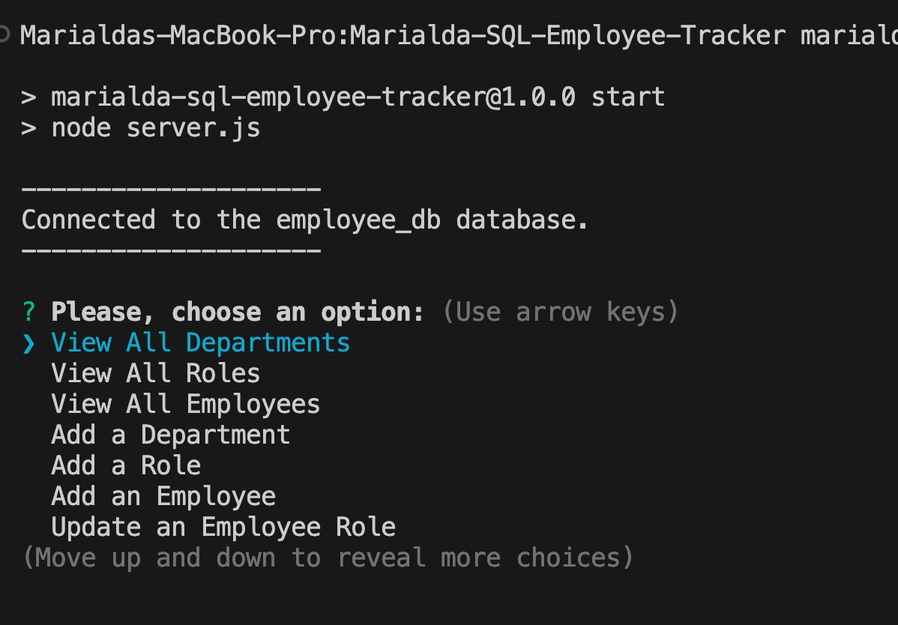

# Marialda-SQL-Employee-Tracker

## Table of Contents
  - [Description](#description)
  - [Screenshot](#screenshot)
  - [Installation](#installation)
  - [Usage](#usage)
  - [Video](#video)
  - [Contact](#contact)
 
## Description
This is a command-line application that manages a company's employee database, using Node.js, Inquirer, and MySQL. It allows non-developers to easily view and interact with information stored in the employee database.

## Screenshot
Initial Menu  
     

## Installation 
1 - npm initialize  
2 - Install inquirer  
3 - Install mysql2  
4 - Run schema.sql  
5 - Run seeds.sql  

## Usage
1 - Run server.js in the terminal  
2 - Main Menu is displayed  
3 - Use the arrow keys to go up and down the menu  
4 - Click enter to select your choice  
5 - A table is displayed with the results  

## Video
https://www.loom.com/share/c09822faafa745d591469a06884722ff?sid=fdc21326-35b9-4a0a-9e1a-c42a1d847da9

## Contact
You can contact me via email: marialda@bellsouth.net
